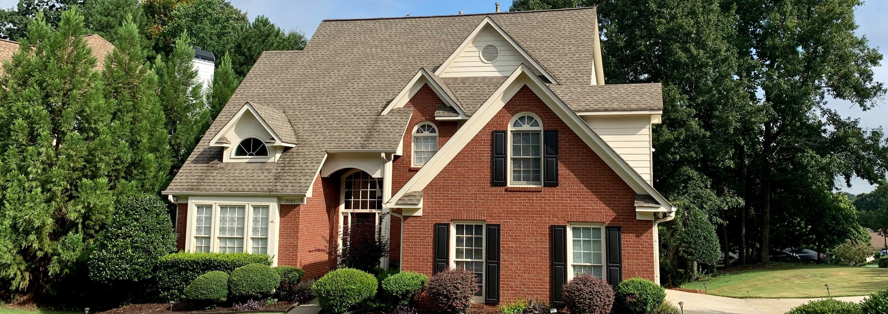

# House Price Prediction Model

This repository contains a simple house price prediction model built using Linear Regression. The model predicts the price of houses based on various features such as the number of bedrooms, bathrooms, square footage and more.

## Dataset

The dataset used for training and testing the model can be found in the `./dataset` directory. It includes information about house characteristics and sale prices.

## Model Evaluation

The model's performance is evaluated using Mean Squared Error (MSE) and R-squared (R2) score. The evaluation results are displayed in the Jupyter Notebook.
The model is saved in the `./model` directory using joblib.